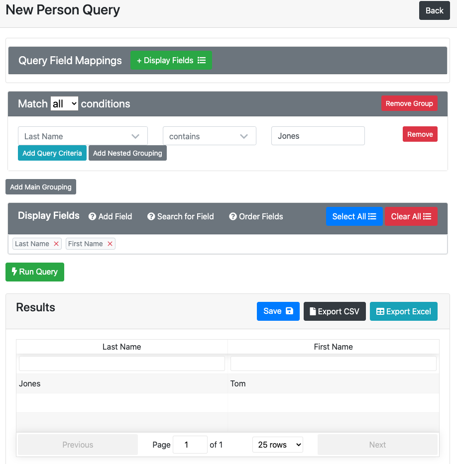
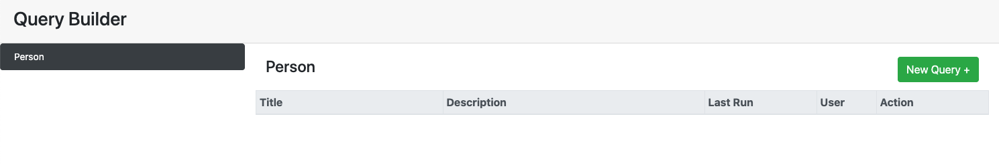

# React Query Builder

A plug-and-play solution to building ad-hoc queries in Rails apps. 



---
## Gemfile

```
gem 'react_query_builder'

gem 'bootstrap'
gem 'jquery-rails'
gem 'jquery-ui-rails'
gem 'react-rails'
gem 'simple_form'
gem 'reform'
gem 'reform-rails'
```

Yes - that's a lot of dependencies.

But this is meant to be a plug-and-play solution.

## Development Group Gemfile

The views in React Query Builder depend on [Scenic](https://github.com/scenic-views/scenic) gem for versioned management. 

```
group :development, :test do
    gem 'scenic'
end
```

---

## Initial Installation

```
$ bundle install
```

```
$ rails g react_query_builder:install
```


### jQuery Asset Dependency
If you do not already have jQuery accesible within the asset pipeline, you'll need to run the jQuery generator:

There is a generator that will attempt to do this for you:
```
$ rails g react_query_builder:jquery
```

If the generator doesn't work in your layout, you'll need to manually require **jquery** and **jquery_ujs** before the **ReactQueryBuilder** code is loaded. 

It will typically be prepended in `app/assets/javascripts/application.js` like this:

```
//= require jquery
//= require jquery_ujs
```


---  

### Add a New View

React Query Builder depends upon views to populate the visible data tables.

Those versioned views are generated using the following command structure:

```
$ rails g react_query_builder:view <view_name>
```

A versioned view will be generated that must be defined in order for the view to show up in Query Builder.

Each time you run the `rails g react_query_builder:view <view_name>` command, along with a new database migration, a new version of the view will be generated in the views folder:

```
db/views/qb_view_name_v01.sql
db/views/qb_view_name_v02.sql
db/views/qb_view_name_v03.sql
```

You must specify the raw SQL needed within the view.  

---

### Person View Example

A view is typically support by a standard **ActiveRecord** model.

In this case, it would be sensible to generate a **Person** model if you don't already have one.

```
$ rails g model Person last_name:string first_name:string middle_name:string
```

```
$ rails g react_query_builder:view person
```

**Location**
```
db/views/qb_view_person_01.sql
```

**View Definition**
```
SELECT people.id,
       people.last_name,
       people.first_name,
       people.middle_name
FROM people;
```


### Run Migrations
After your view is specified you'll need to run migrations:

```
$ rails db:migrate
```

Once your migration is run, you should see the view show up in Query Builder.



---
## Button CSS Styling

By default, there is a **react_query_builder.css** file added to your stylesheets directory.  Within that file, you can make any necessary styling adjustments to the look and feel of the Query Builder.

All of the buttons within the application have class references you can use to easily override the default styling provided.

### Apply to All Buttons:
```
# ALL BUTTONS
.rqb_btn { }
```

### Apply to Specific Buttons:
```
# BACK
.rqb_back_btn { }

# RUN
.rqb_run_btn { }

# EDIT
.rqb_edit_btn { }

# DELETE
.rqb_delete_btn { }

# EXCEL
.rqb_excel_btn { }

# CSV 
.rqb_csv_btn { }

# SAVE AS
.rqb_save_as_btn { }

# SAVE
.rqb_save_btn { }

# NEW QUERY
.rqb_new_query_btn { }

# BACK
.rqb_back_btn { }

# DISPLAY FIELDS
.rqb_display_fields_btn { }

```
---
### Overriding Methods using Controller Initializer

You can easily override default behavior of the gem by placing an evaluated version of a class as an initializer file in your app:


You might, for example, create a file named:

`/app/config/initializers/react_query_builder.rb`

To override some controller behavior in the base app:

```
ReactQueryBuilder::QueryBuilderController.class_eval do

	def method_name
		#Whatever override behavior you want to use
	end

end
```
---
### Default Behavior & Inheritance

React Query Builder uses an abstract class to allow you to set default functionality across the entire Gem.

If you need some default behavior inherited, do it within **QueryBuilderRecord**.  

An example would be if you needed to query against a different database than the one **ActiveRecord** points to in your application.   In that case, you'd change the class that **QueryBuilderRecord** inherits from.

```
app/models/query_builder_record.rb
```

By default, the class inherits from **ApplicationRecord**.

```
class QueryBuilderRecord < ApplicationRecord

	...

end
```

You can also use the **QueryBuilderRecord** to specify any system-wide behavior you want inherited by all other Query Builder views.  

Query Builder views are any models prefixed by **qb_** in the filename.  They are generated by using the `rails g react_query_builder:view <view_name_here>` command.

---
### Preventing Data Bleeds

If you have permissions assigned to data models, you might need to prevent certain views from being accessible to a particular user.

You can achieve this by overriding the default **#result_data** method in the initializer.

For example, you might choose to pass options with multiple keys that contains the **#current_ability** that a user has (in case of using [CanCanCan](https://github.com/CanCanCommunity/cancancan)).

```
ReactQueryBuilder::QueryBuilderController.class_eval do

	#This allows the controller to use the user's current ability to prevent data bleeds!
	def result_data
		@report.results({search: @search, current_ability: current_ability})
	end

end
```


All data queries are made at a single spot within the Query Record model:

```
app/models/query_builder_record.rb
```

```
class QueryBuilderRecord < ApplicationRecord

    ...
    
    def self.results(options)
        #method override goes here
    end
    
    ...
    
end    
```

If you have some exception to the default behavior, you can also override the method in a specific Query Builder model:

```
class QbPerson < ::QueryBuilder

	...

	def self.results(options)
		#method override goes here
	end
	
	...

end   
```
---
### Specifying Custom Username Method

By default, React Query Builder is configured to use the **#username** method of the current_user.  

If you are using a different method, it can be overriden by specifying a different method name within:
```
app/models/query_builder_record.rb
```

```
class QueryBuilderRecord < ApplicationRecord

	...

	def self.user_method
		"custom_method_name_here"
	end
	
	...

end
```
---

### Boolean Overrides

If you would prefer that your data is displayed with values other than true / false for Booleans within your data, you may specify those override values.

Use the following format within your QueryBuilder model (e.g. ReactQueryBuilder::QbPerson):

```
def boolean_override
	{
	   :column_name_1 => ["Value if True", "Value if False"],
           :column_name_2 => ["Value if True", "Value if False"]
        }
end
```

---

### Type Overrides

Need to coerce your displayed data into a different data type?  No problem.

Use the following format with your QueryBuilder model (e.g. ReactQueryBuilder::QbPerson).

```
#Define your column types here
def self.type_overrides
	{
		:column_name_1 => :decimal,
		:column_name_2 => :integer,
		:column_name_3 => :string,
	}
end

#Define the behavior of how you data is displayed by defining your column names by hand
#You can use 'super' to inerhit the default behavior

def column_name_1
  t = super
  #Do whatever you want with the inherited behavior
end

def column_name_2
  super  
end

def column_name_3
  super	  
end
```


### Rails 7 - Turbo Rails & Import Maps

By default, Rails 7 comes with `@hotwired/turbo-rails` package and `importmaps` gem.  

Within `javascript/application.js` you will see:

```
import "@hotwired/turbo-rails"
```

**React Query Builder is NOT currently compatible with Turbo Rails.**

If you want to use Turbo Rails on other pages of your app, you could consider a modification like this within 
`app/views/layouts/application.html.erb` (or whatever layout you are dealing with):

```
<%= javascript_importmap_tags unless request.env['PATH_INFO'].include?('/query_builder') %>
```

Pull requests are welcome if you have an implementation that is backwards compatible without this work-around.
